  

<h1 align="center">Hi 👋, I'm Prajith Kumar</h1>

<h3 align="center">
  Software Engineer • Java • Spring Boot • React • AWS
</h3>

---

## 👨‍💻 About Me

<table>
<tr>

<td width="55%" valign="top">

### 🚀 Software Engineer

I'm a software engineer focused on building practical, scalable applications and improving my backend engineering skills.

- 🎓 B.Tech in Electronics & Communication Engineering
- ☕ Java & Spring Boot
- ⚛️ React & Full Stack Development
- 🔗 REST API Development
- ☁️ AWS & Cloud Technologies
- 🐍 Python & AI/ML
- 🗄️ SQL & NoSQL Databases
- 🐳 Docker & Git
- 🚀 Interested in scalable backend systems

</td>

<td width="45%" valign="top">

### 🎯 Current Focus

- Backend Engineering
- System Design
- Data Structures & Algorithms
- Cloud Architecture
- DevOps & CI/CD
- Building production-ready applications
- Learning scalable software architecture

</td>

</tr>
</table>

---

## 🛠️ Tech Stack

### 💻 Languages

### ⚙️ Frameworks & Development

### ☁️ Cloud & Database

### 🧰 Tools

---

## 🚀 Featured Projects

<table>

<tr>

<td width="50%" valign="top">

<h3>🧠 Smart Task Analyzer</h3>

AI-assisted task analysis application built using Django and React.

<b>Technology</b>

Python • Django • React • JavaScript

</td>

<td width="50%" valign="top">

<h3>🎮 Gesture Controlled Subway Surfers</h3>

Computer-vision based gesture-controlled gaming project.

<b>Technology</b>

Python • OpenCV • MediaPipe

</td>

</tr>

<tr>

<td width="50%" valign="top">

<h3>🚗 SmartCarHub</h3>

Full-stack car rental application using Java and Spring Boot.

<b>Technology</b>

Java • Spring Boot • React • PostgreSQL

</td>

<td width="50%" valign="top">

<h3>⚡ Green Energy EV Charging</h3>

Hybrid solar + wind roadside EV charging concept.

<b>Technology</b>

Raspberry Pi • OpenCV • YOLO • IoT

</td>

</tr>

</table>

---

## 🏆 Achievements

<table>

<tr>

<td align="center" width="25%">

<h2>🏆</h2>

<b>Smart India Hackathon</b>

 

Hackathon Experience

</td>

<td align="center" width="25%">

<h2>⚡</h2>

<b>EV Innovation</b>

 

Green Energy Charging

</td>

<td align="center" width="25%">

<h2>📜</h2>

<b>Patent</b>

 

Patent-listed Innovation

</td>

<td align="center" width="25%">

<h2>💻</h2>

<b>Full Stack</b>

 

Modern Web Applications

</td>

</tr>

</table>

---

## 📚 Currently Learning

<table>

<tr>

<td width="35%">

<b>Java & Spring Boot</b>

</td>

<td>

████████████████████ 100%

</td>

</tr>

<tr>

<td>

<b>Data Structures</b>

</td>

<td>

██████████████████░░ 90%

</td>

</tr>

<tr>

<td>

<b>AWS & Cloud</b>

</td>

<td>

████████████████░░░░ 80%

</td>

</tr>

<tr>

<td>

<b>System Design</b>

</td>

<td>

███████████████░░░░░ 75%

</td>

</tr>

<tr>

<td>

<b>DevOps & CI/CD</b>

</td>

<td>

██████████████░░░░░░ 70%

</td>

</tr>

</table>

---

## 💻 Developer Mode

---

## 📫 Connect With Me

---

<b>Keep Building • Keep Learning • Keep Growing 🚀</b>

  

